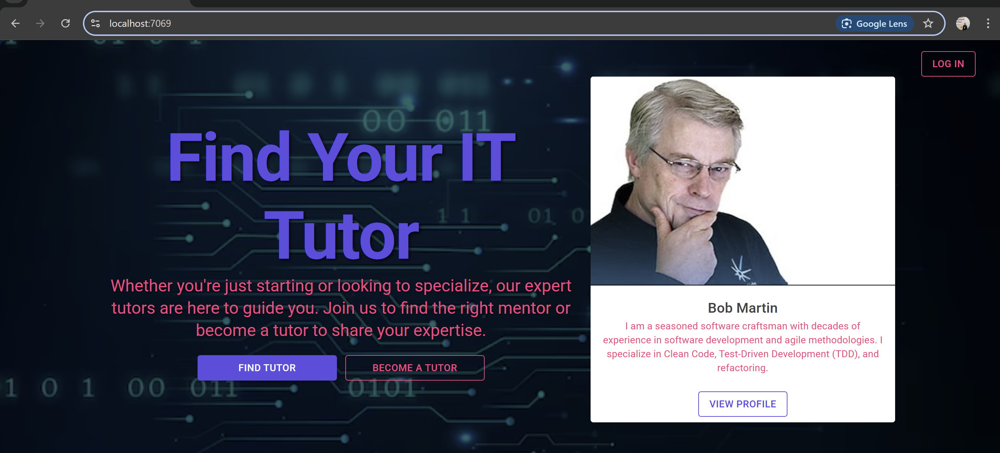
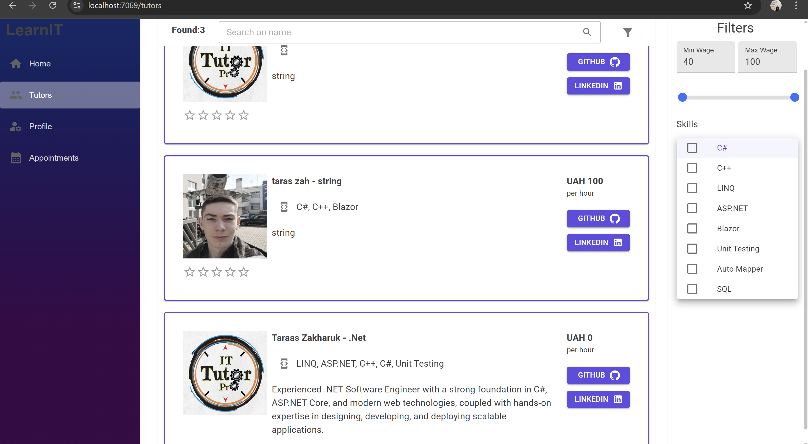
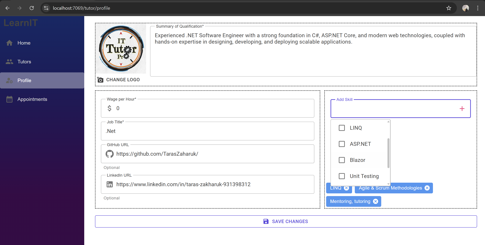
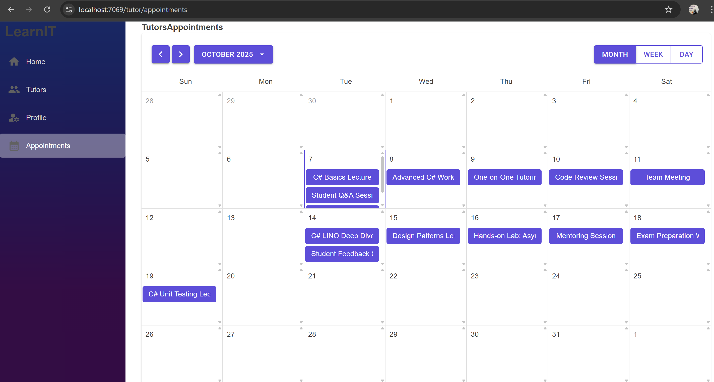
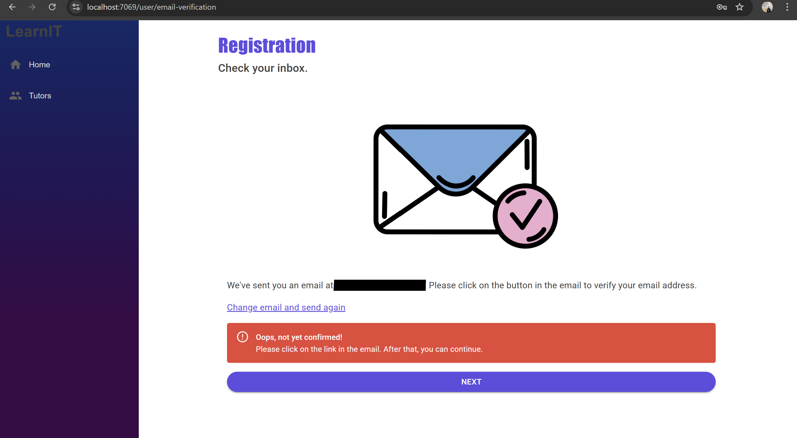
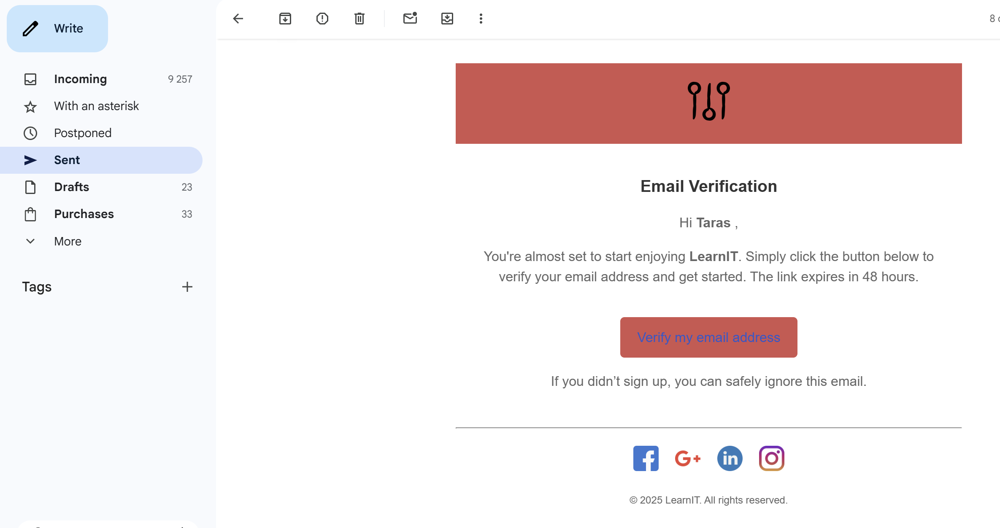
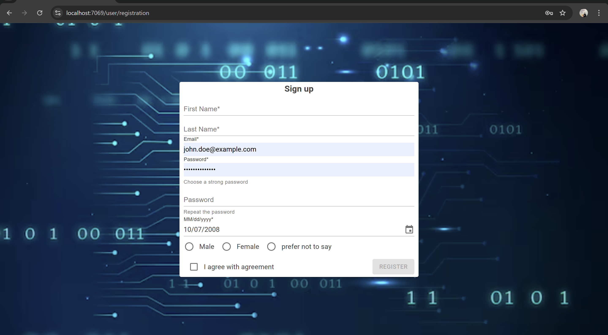
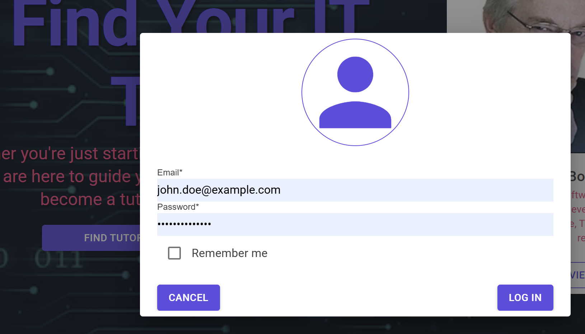

# 💻 DevConnect — Find, Learn, Teach

  

**DevConnect** is a web platform built for developers, tutors, and students who want to connect, collaborate, and solve coding challenges together.  
It includes user authentication, email verification, and profile management — all designed to make finding help or offering mentorship effortless.

---

## 🌐 Features

- 🔐 **Authentication System** – Secure login and registration for users.  
- ✉️ **Email Verification** – Confirm your account via email before accessing key features.  
- 👥 **Tutor & Student Profiles** – Display your skills, experience, and learning goals.  
- 📅 **Appointments** – Schedule sessions with tutors and manage upcoming meetings.  
- 💬 **Request System (in progress)** – Easily request help from available tutors.  
- 📞 **Meeting System (in development)** – Seamless video or chat sessions directly within the platform.

---

## 🖼️ Screenshots

  
   
  
   
  
   
  
  

---

## 🚀 Current Focus

I’m currently developing:
- A **meeting system** for real-time tutor–student sessions.  
- A **request logic** that allows students to reach out to specific tutors for help.

---

## 💡 Purpose

This project aims to support:
- Developers who want to help others with technical challenges.  
- Tutors who teach programming and IT skills.  
- Students learning software development who need mentorship.

---

  Made with ❤️ to connect developers and learners everywhere.

